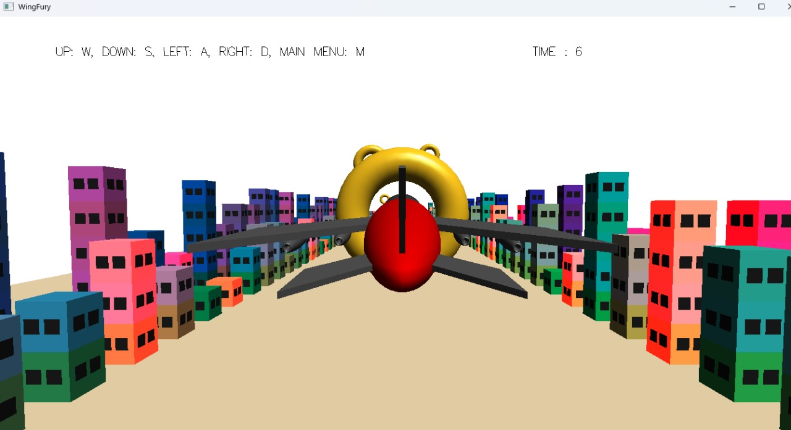
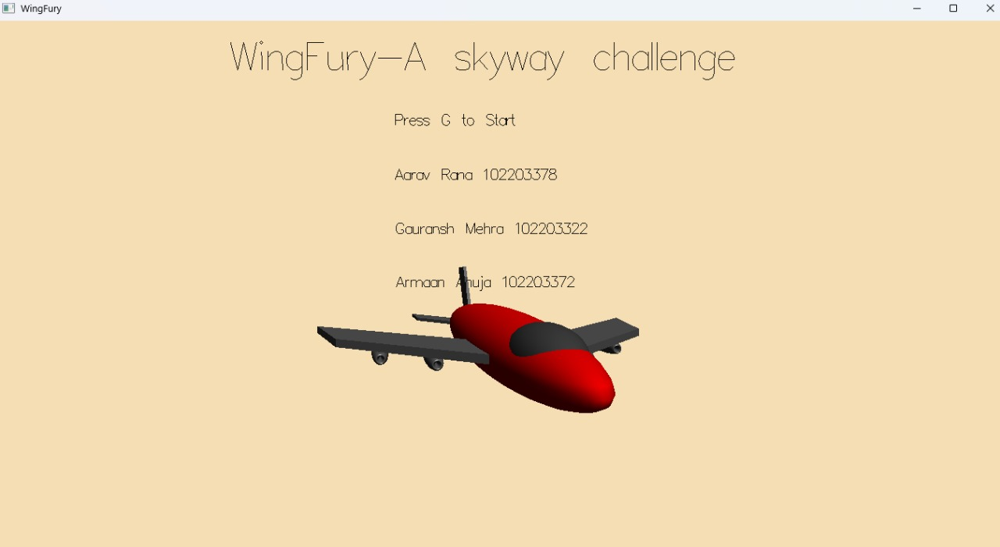

# ✈️ WingFury - A skyway challenge

A stunning 3D airplane game built using **OpenGL**, **FreeGLUT**. Navigate your aircraft through rings, dodge buildings, and explore a dynamically animated environment!

---

## 🚀 Features

- 🌆 3D environment with buildings, sky, and ground
- ✈️ Airplane model loading via Assimp
- 🎮 Smooth flight controls (pitch, roll, yaw, throttle)
- 🌀 Rings and obstacles to fly through
- 🖥️ Camera system with `gluLookAt`
- 🌈 Beautiful background and object shading

---

## 🛠️ Tech Stack

- **Language**: C++
- **Graphics**: OpenGL (Legacy)
- **Windowing**: GLUT (FreeGLUT)
- **Model Loading**: Assimp
- **Build System**: CMake / Makefile

---

## 🎮 Controls

| Key        | Action              |
|------------|---------------------|
| `W` / `S`  | Pitch up / down     |
| `A` / `D`  | Roll left / right   |
| `Q` / `E`  | Yaw left / right    |
| `Arrow Up`| Increase throttle    |
| `Arrow Down`| Decrease throttle  |
| `Esc`      | Exit game           |

---

## 📸 Screenshots

  
  

